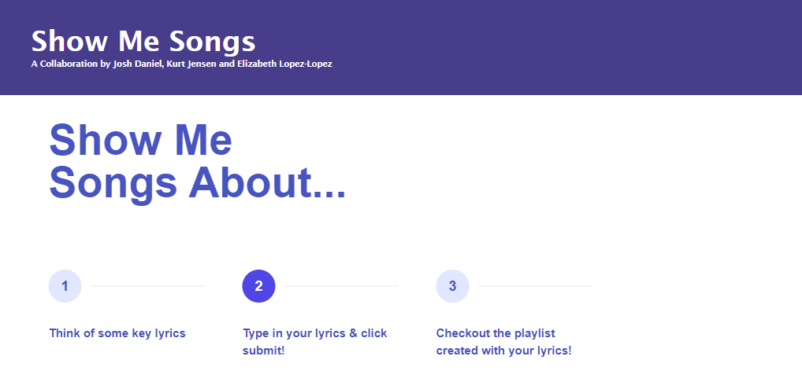
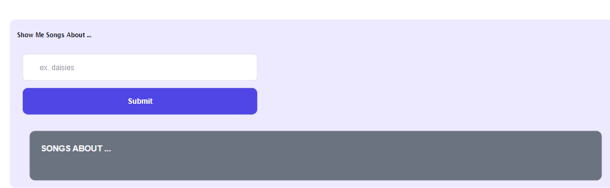

# show-me-songs

## Description

In todays world many APIs exist. Our team wanted to take two APIs and merge them to create a functional application taht would allow users to search song lyrics through the ChartLyrics API to then generate a YouTube playlist. The idea was to better utilize these exisitng APIs to create a more condensed playlist that is truly specific to what the user wants to hear. 

## Installation

There is no installation necessary, and you can access our site at: https://kurtmj93.github.io/show-me-songs/

## Usage

The [website](https://kurtmj93.github.io/show-me-songs/) created allows access our application and find your own playlist based off your lyrics search 

You can also scroll down on the webpage to view your created playlsit 

You can look through the GitHub [repo](https://kurtmj93.github.io/show-me-songs/) to view how our the application was created. 

## Credits

Kurt Jensen
Josh Daniels
Elizabeth Lopez-Lopez

Tailwind
chartLyrics
YouTube

## License

Please refer to the license included in the repo. 

